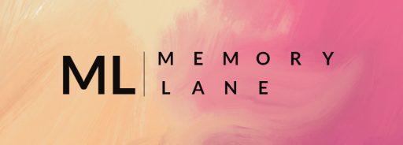
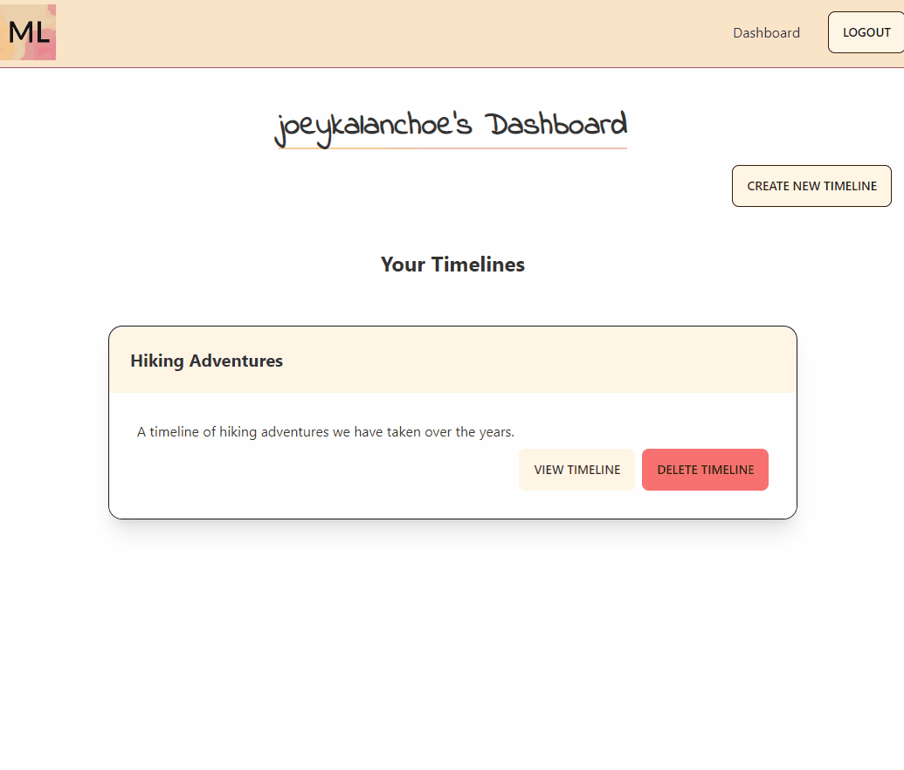

# **Memory Lane**

*Moments in Time, All in One Place*

## **Description**
---
<a href="https://the-memory-lane.herokuapp.com/" target="_blank">Memory Lane</a> is a web app where users can create visually appealing, minimalistic timelines easily.

## **Table of Contents**
---
1. [Usage](#usage)
2. [Technologies Used](#technologies-used)
3. [Credits](#credits)
4. [License](#license)

## **Usage**
---
To use our web app, you should start by visiting the site <a href="https://the-memory-lane.herokuapp.com/" target="_blank">here</a>.

When you enter the site you will be greeted by a hero image with some details on our site. From our homepage you can navigate to three user timelines which already have been populated with some moments. This is a great place to start so you can view what a potential timeline would look like.

Once you have gotten a look at what a timeline can be, you should signup by clicking the LOGIN button located on the navigation bar. A modal will pop up and if you click sign up you can create an account.

Once you have created an account you will be redirected to a dashboard page. On the dashboard page you can create a new timeline to get started.

Once you have created a timeline you can get started by adding moments to the timeline! Make sure to fill out all the fields and remember the image link section is for a link to an image on the web!

To delete a moment, simply click the delete moment button on the moment card. Please be warned that this is permanent and you will need to completely recreate it if you want to undo it.

## **Technologies Used**
---

## **Credits**
---
This project was built by [Joey Bennett](https://github.com/coderbennett), [Maung Htike](https://github.com/Sfzmango) and [Caitlin Lindauer](https://github.com/CL2731).

If you like our work please reach out! You can find our contact details and portfolio pages on our GitHub profiles linked above.

## **License**
---
MIT License

Copyright (c) 2022 Memory Lane Team

Permission is hereby granted, free of charge, to any person obtaining a copy
of this software and associated documentation files (the "Software"), to deal
in the Software without restriction, including without limitation the rights
to use, copy, modify, merge, publish, distribute, sublicense, and/or sell
copies of the Software, and to permit persons to whom the Software is
furnished to do so, subject to the following conditions:

The above copyright notice and this permission notice shall be included in all
copies or substantial portions of the Software.

THE SOFTWARE IS PROVIDED "AS IS", WITHOUT WARRANTY OF ANY KIND, EXPRESS OR
IMPLIED, INCLUDING BUT NOT LIMITED TO THE WARRANTIES OF MERCHANTABILITY,
FITNESS FOR A PARTICULAR PURPOSE AND NONINFRINGEMENT. IN NO EVENT SHALL THE
AUTHORS OR COPYRIGHT HOLDERS BE LIABLE FOR ANY CLAIM, DAMAGES OR OTHER
LIABILITY, WHETHER IN AN ACTION OF CONTRACT, TORT OR OTHERWISE, ARISING FROM,
OUT OF OR IN CONNECTION WITH THE SOFTWARE OR THE USE OR OTHER DEALINGS IN THE
SOFTWARE.
